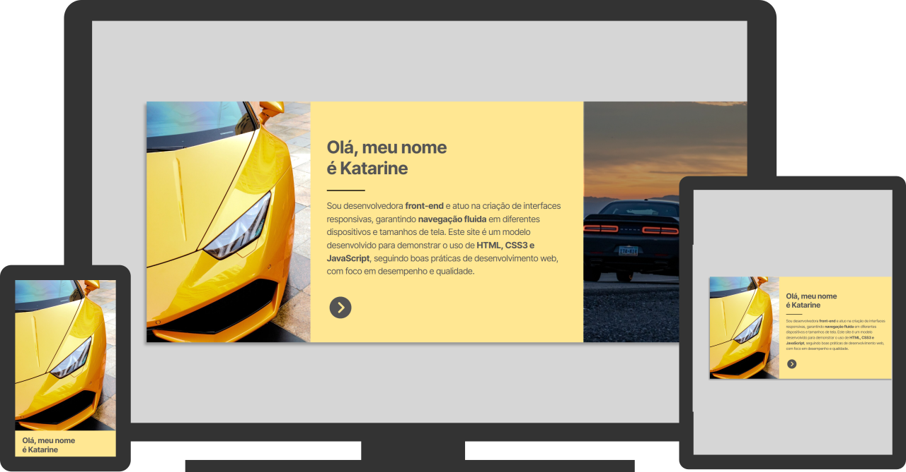

# Automóveis Site

### HTML5 + CSS3 e JavaScript

Acesse o projeto: [Automóveis Site](https://albuquerque-katarine.github.io/automoveis-site)

### Sobre o projeto

Este site é um modelo demonstrativo desenvolvido com foco em design responsivo e experiência do usuário, adaptando o comportamento da navegação conforme o dispositivo. No desktop, utiliza scroll horizontal controlado por JavaScript, enquanto no mobile mantém o scroll vertical nativo, garantindo usabilidade e fluidez. A estrutura foi construída com HTML, CSS3 e JavaScript, seguindo boas práticas de front-end, organização de código e adaptação a diferentes tamanhos de tela.

### Finalidade do projeto

A finalidade deste trabalho é demonstrar habilidades em desenvolvimento front-end, aplicando conceitos de design responsivo, usabilidade e controle de navegação. O projeto evidencia a capacidade de adaptar o comportamento do site para diferentes dispositivos, garantindo uma experiência fluida tanto no desktop quanto no mobile, além de apresentar boas práticas no uso de HTML, CSS3 e JavaScript.

### Contato
#### Fale comigo através dos contatos abaixo:

Linkedin: [/katarine-albuquerque](https://www.linkedin.com/in/katarine-albuquerque/) 
E-mail: [kba.2879@gmail.com](mailto:kba.2879@gmail.com)